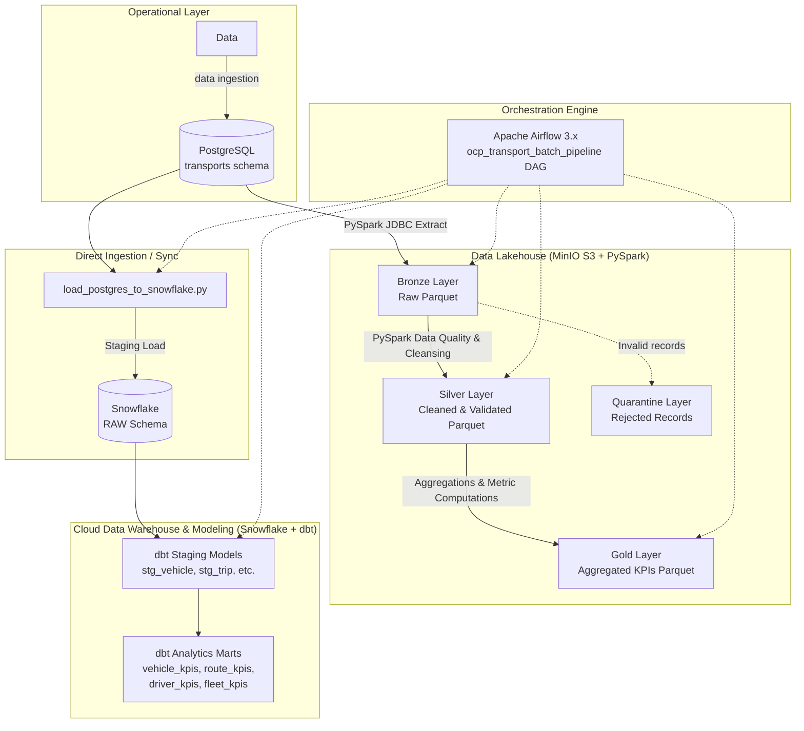

# OCP Transport Intelligence Platform 🚛📊

An enterprise-grade, end-to-end Data Engineering and Analytics platform designed for logistics and fleet transportation management at OCP Group. The platform ingests operational transport and telemetry data, processes it through a Medallion Lakehouse architecture using Apache Spark (PySpark) and MinIO, replicates data to Snowflake, transforms analytical data marts using dbt, and orchestrates the entire workflow with Apache Airflow.

---

## 🏗️ Architecture Overview



---

## 🛠️ Tech Stack

| Technology | Role |
| :--- | :--- |
| **PostgreSQL 16** | Operational OLTP database storing transactions, vehicles, drivers, and trips |
| **MinIO** | S3-compatible Object Storage powering the Lakehouse (Bronze / Silver / Gold) |
| **Apache Spark (PySpark 3.5)** | Distributed data processing, validation, and KPI transformations |
| **Snowflake** | Cloud Data Warehouse hosting the raw staging and analytical reporting marts |
| **dbt (Data Build Tool)** | Data modeling, transformations, testing, and schema documentation |
| **Apache Airflow 3.x** | Workflow orchestration, task dependency management, and pipeline monitoring |
| **Streamlit** | Interactive Python web dashboard visualizing Gold KPIs directly from Snowflake |
| **Docker & Docker Compose** | Multi-container environment for Postgres, MinIO, and Airflow services |
| **Python & Faker** | Data generation and ETL scripts |

---

## 📂 Medallion Lakehouse Architecture

The Lakehouse layer follows the **Medallion Architecture** pattern using MinIO S3 object storage:

### 1. 🥉 Bronze Layer (`s3a://ocp-data/bronze/`)
- Ingests raw data from PostgreSQL via PySpark JDBC (`org.postgresql.Driver`).
- Overwrites and stores datasets in columnar Parquet format:
  - `vehicle`, `driver`, `route`, `trip`, `gps_event`, `fuel_transaction`, `maintenance`, `incident`.

### 2. 🥈 Silver Layer (`s3a://ocp-data/silver/`)
- Trims whitespace, standardizes casing (e.g. uppercase license plates).
- Enforces strict business validations and data quality checks (e.g., non-negative distances, valid fuel types, valid statuses).
- **Quarantine Pattern (`s3a://ocp-data/quarantine/`)**: Any records failing data quality rules are routed to the quarantine path for inspection without breaking the pipeline.

### 3. 🥇 Gold Layer (`s3a://ocp-data/gold/`)
- Aggregated, analytics-ready business datasets:
  - **`vehicle_kpis`**: Total distance, trip counts, fuel consumption, downtime, maintenance costs, efficiency.
  - **`route_kpis`**: Planned vs. actual distance, route deviation km and percentage, cargo tons delivered, average duration.
  - **`driver_kpis`**: Completed trips, total distance driven, average cargo carried, safety incident counts.
  - **`fleet_kpis`**: High-level fleet-wide health, operational utilization, total fuel expenses, incident rates.

---

## ❄️ Analytics Engineering with dbt & Snowflake

The dbt project (`dbt/ocp_transport/`) models data within Snowflake across two layers:

### Staging Models (`models/staging/`)
- `stg_vehicle.sql`: Standardized vehicle dimension with valid capacity and year checks.
- `stg_driver.sql`: Driver dimension with experience and status tracking.
- `stg_route.sql`: Planned routes, origin/destination pairs, and planned distances.
- `stg_trip.sql`: Trips with calculated trip duration in minutes and validity constraints.
- `stg_gps_event.sql`: Telemetry events with geographic and speed validations.
- `stg_fuel_transaction.sql`: Fuel receipts with calculated total transaction costs.
- `stg_maintenance.sql`: Maintenance logs with downtime hours and cost tracking.
- `stg_incident.sql`: Safety incidents with severity classifications.

### Analytics Marts (`models/analytics/`)
- `vehicle_kpis.sql`: Aggregated performance, cost per vehicle, maintenance metrics.
- `route_kpis.sql`: Route deviations, efficiency, cargo throughput.
- `driver_kpis.sql`: Driver performance, completion rates, incident records.
- `fleet_kpis.sql`: Executive-level operational metrics and fleet KPIs.

---

## ⏱️ Orchestration: Airflow Batch Pipeline

The DAG `ocp_transport_batch_pipeline` orchestrates tasks in the following sequence:

```
load_postgres_to_snowflake
           │
           ▼
    bronze_ingestion
           │
           ▼
  silver_transformation
           │
  ┌────────┼────────┬────────┐
  ▼        ▼        ▼        ▼
gold_   gold_    gold_    gold_
vehicle route    driver   fleet
  └────────┬────────┴────────┘
           ▼
        dbt_run
           │
           ▼
        dbt_test
```

---

## 📁 Repository Structure

```
├── .env.example                      # Template environment variables
├── .gitignore                        # Git ignore rules for environments, logs, and data
├── docker-compose.yml                # Docker services (Postgres, MinIO, Airflow, Cloudflare)
├── requirement.txt                   # Python dependencies
├── readme.md                         # Project documentation
│
├── airflow/                          # Airflow orchestration
│   ├── dags/
│   │   └── ocp_transport_batch.py    # Main Airflow batch DAG
│   └── dockerfile                    # Custom Airflow image with Spark, dbt, and Java 17
│
├── database/                         # Database DDL & configs
│   ├── minio/
│   │   └── snowflake-readonly.json   # MinIO bucket policy for Snowflake access
│   ├── queries/
│   │   └── kpis.sql                  # Analytical SQL queries
│   └── schema/
│       └── tables.sql                # PostgreSQL DDL table schemas and constraints
│
├── dbt/                              # dbt Analytics Project
│   ├── profiles.yml                  # Snowflake connection profile
│   └── ocp_transport/
│       ├── dbt_project.yml           # dbt project configurations
│       ├── macros/
│       └── models/
│           ├── staging/              # Staging SQL models & sources
│           └── analytics/            # Marts SQL models & schema tests
│
├── docs/                             # Documentation
│   └── logical_data_model.md         # Detailed logical data model & business rules
│
├── drivers/                          # Database drivers
│   └── postgresql-42.7.12.jar        # PostgreSQL JDBC driver for Spark
│
└── src/                              # Core Python & Spark code
    ├── dashboard/                    # Streamlit Dashboard application
    │   └── app.py                    # Main dashboard script
    ├── generate_data.py              # Synthetic data generator for PostgreSQL
    ├── load_postgres_to_snowflake.py # Direct Postgres-to-Snowflake sync
    ├── snowflake_test.py             # Snowflake connectivity test
    └── pyspark/                      # Spark ETL & Medallion scripts
        ├── bronze_ingestion.py       # Postgres -> MinIO Bronze
        ├── silver_transformations.py # Bronze -> Silver & Quarantine
        ├── gold_vehicle_kpis.py      # Vehicle KPIs Gold mart
        ├── gold_route_kpis.py        # Route KPIs Gold mart
        ├── gold_driver_kpis.py       # Driver KPIs Gold mart
        ├── gold_fleet_kpis.py        # Fleet KPIs Gold mart
        ├── trip_analysis.py          # Ad-hoc PySpark trip analysis
        └── minio_test.py             # MinIO connectivity test
```

---

## 🚀 Getting Started

### 1. Clone the Repository
```bash
git clone https://github.com/Yussefech31/tracking-ocp.git
cd tracking-ocp
```

### 2. Configure Environment Variables
Copy `.env.example` to `.env` and fill in your Snowflake and service credentials:
```bash
cp .env.example .env
```

### 3. Launch Services with Docker Compose
```bash
docker compose up -d
```
Services available:
- **PostgreSQL**: `localhost:5433`
- **MinIO Console**: `http://localhost:9001` (User: `minio_admin`, Password: `minio_password123`)
- **MinIO S3 API**: `http://localhost:9000`
- **Airflow Webserver**: `http://localhost:8083` (User: `admin`, Password: `admin`)

### 4. Initialize Database & Generate Test Data
```bash
# Execute schema creation in PostgreSQL
docker exec -i ocp-postgres psql -U ocp_admin -d ocp_transport < database/schema/tables.sql

# Generate realistic test records
python src/generate_data.py
```

### 5. Trigger the Airflow Pipeline
Access the Airflow UI at `http://localhost:8083`, unpause the DAG `ocp_transport_batch_pipeline`, and trigger a run to execute the end-to-end ingestion, Spark medallion transformations, and dbt models.

### 6. Run the Streamlit Dashboard
Once the pipeline finishes and data lands in Snowflake, start the interactive dashboard to visualize the Gold KPIs:
```bash
python -m streamlit run src/dashboard/app.py
```
The dashboard will be available at `http://localhost:8501`.
